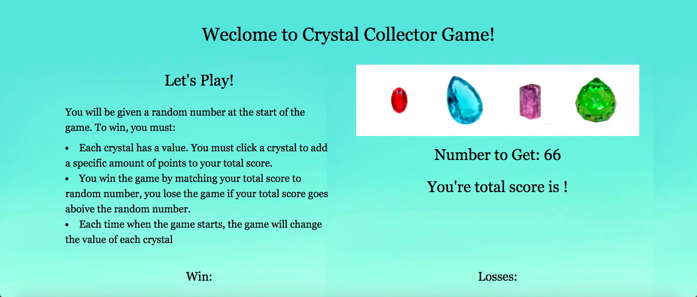

# Crystals Game

## How to play the game:

⋅⋅⋅ Each crystal generates a different value in each game. The game starts with the app generating an random word between 19 - 120.⋅⋅

⋅⋅⋅ To win, you must:
- click a crystal to add a specific amount of points to your total score.
- You win the game by matching your total score to random number, you lose the game if your total score goes aboive the random number. 

[Play the game here!](https://divyaayikkara9497.github.io/week-4-game/)